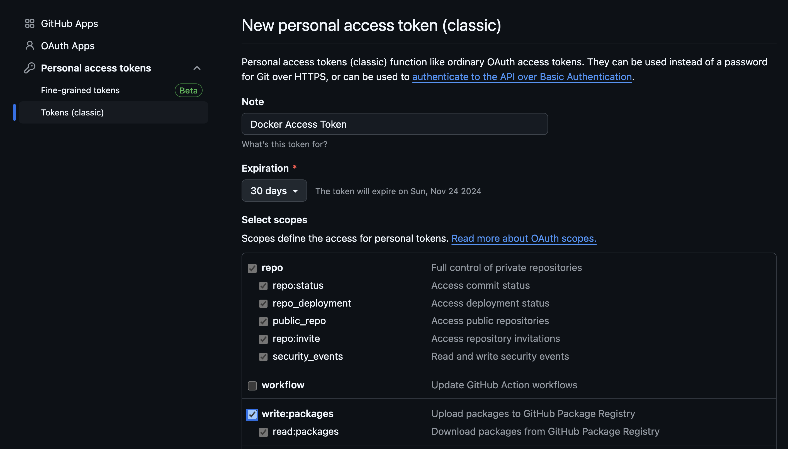

# Docker Lab: CIDR to Subnet Mask API

In this lab, we will build, run, and test a Dockerized Python application that converts CIDR notation to a subnet mask and exposes it as a REST API.

## Prerequisites

- Ensure you have `app.py`, `requirements.txt`, and the `Dockerfile` in your project directory.
- Docker installed on your system.

## Step 1: Verify Files

Ensure the following files are present in your project directory:

### 1. **`app.py`**: The Python application file

```python
from flask import Flask, request, jsonify
import ipaddress

app = Flask(__name__)

@app.route('/cidr-to-subnet', methods=['GET'])
def cidr_to_subnet():
    cidr = request.args.get('cidr')
    try:
        # Create an IPv4Network object from the CIDR
        network = ipaddress.IPv4Network('0.0.0.0/' + cidr)
        # Return the subnet mask
        return jsonify({'subnet': str(network.netmask)})
    except ValueError:
        return jsonify({'error': 'Invalid CIDR'}), 400

if __name__ == '__main__':
    app.run(host='0.0.0.0', port=5000)
```

### Explanation:
- The Python app uses **Flask** to manage REST API requests.
- The `/cidr-to-subnet` endpoint accepts a **GET** request with a query parameter `cidr` (e.g., `24` for CIDR `/24`).
- The app takes this CIDR prefix and converts it into an IPv4 subnet mask using Python's built-in **ipaddress** library.
- The result is returned as a JSON object containing the subnet mask (e.g., `255.255.255.0` for CIDR `/24`).
- The app also includes error handling to return an appropriate error message if an invalid CIDR value is provided.

### 2. `requirements.txt`: The file listing dependencies

```txt
flask
ipaddress
```

This file specifies the external libraries needed by the application:

- **Flask**: A web framework for building the REST API.
- **ipaddress**: A library to handle IPv4 addresses and convert CIDR to subnet masks.

### 3. `Dockerfile`: Instructions to containerize the app

```dockerfile
# Use an official Python runtime as a parent image
FROM python:3.9-slim

# Set the working directory in the container
WORKDIR /app

# Copy the current directory contents into the container at /app
COPY . /app

# Copy requirements.txt and install dependencies
COPY requirements.txt ./
RUN pip install --no-cache-dir -r requirements.txt

# Make port 5000 available to the world outside this container
EXPOSE 5000

# Run app.py when the container launches
CMD ["python", "app.py"]
```

### Explanation:
- **FROM python:3.9-slim**: This pulls the official lightweight Python 3.9 image to minimize the size of the container.
- **WORKDIR /app**: Sets the working directory inside the container to `/app`, where the application code will reside.
- **COPY . /app**: Copies the entire content of the current directory (including `app.py`, `requirements.txt`, etc.) into the container's `/app` directory.
- **COPY requirements.txt ./**: Copies the `requirements.txt` file separately to install dependencies.
- **RUN pip install --no-cache-dir -r requirements.txt**: Installs the required Python dependencies (Flask, ipaddress) from `requirements.txt` without caching to keep the image small.
- **EXPOSE 5000**: Exposes port 5000, which is the default port Flask runs on, so that the API can be accessed from outside the container.
- **CMD ["python", "app.py"]**: Specifies the command to run when the container starts — in this case, launching the Flask app.

## Step 2: Build the Docker Image

Now, build the Docker image using the Dockerfile. In the terminal, navigate to the directory containing your project files (`app.py`, `requirements.txt`, and `Dockerfile`) and run:

```bash
docker build -t cidr-to-subnet:latest .
```

This command will build the image and tag it as `cidr-to-subnet:latest`

## Step 3: Create a GitHub Personal Access Token (PAT)

1. Go to your GitHub account settings.
2. Navigate to **Developer settings** > **Personal access tokens** > **Tokens (classic)**.
3. Click on **Generate new token**.
4. Provide a note for your token (e.g., "Docker Access Token").
5. Select the scopes you want to grant this token (at least `write:packages` and `read:packages`).
6. Click on **Generate token** and copy the token for future use.



## Step 4: Login to GitHub Container Registry

Use the following command to log in to the GitHub Container Registry:

```bash
echo <YOUR_GITHUB_PAT> | docker login ghcr.io -u <YOUR_GITHUB_USERNAME> --password-stdin
```

Replace `<YOUR_GITHUB_PAT>` with your Personal Access Token and `<YOUR_GITHUB_USERNAME>` with your GitHub username.

## Step 5: Tag and Publish the Image to GitHub Container Registry

After building your image, tag it for the GitHub Container Registry and push it:

```bash
docker tag cidr-to-subnet:latest ghcr.io/<YOUR_GITHUB_USERNAME>/cidr-to-subnet:latest
docker push ghcr.io/<YOUR_GITHUB_USERNAME>/cidr-to-subnet:latest
```

### Set the Package Visibility

1. Navigate to the **Packages** section of your public repository.
2. Find your Docker package (the image you pushed).
3. Click on the package name, then go to **Package settings**.
4. Under **Visibility**, select **Public** and save the changes.


## Step 6: Run the Docker Container and Test the API Using Play with Docker

1. Go to [Play with Docker](https://labs.play-with-docker.com/).
2. Click on **Start** to create a new session.
3. Once your session is ready, open a terminal.
4. Pull the image from GitHub Container Registry:

   ```bash
   docker pull ghcr.io/<YOUR_GITHUB_USERNAME>/cidr-to-subnet:latest
   ```
5. Run the Docker container in detached mode:

   ```
   docker run -d -p 5000:5000 ghcr.io/<YOUR_GITHUB_USERNAME>/cidr-to-subnet:latest
   ```

6. Test the API using `curl`:

   ```
   curl "http://localhost:5000/cidr-to-subnet?cidr=24"
   ```

   You should receive a JSON response with the subnet mask:

   ```json
    {
      "subnet_mask": "255.255.255.0"
    }
   ```


