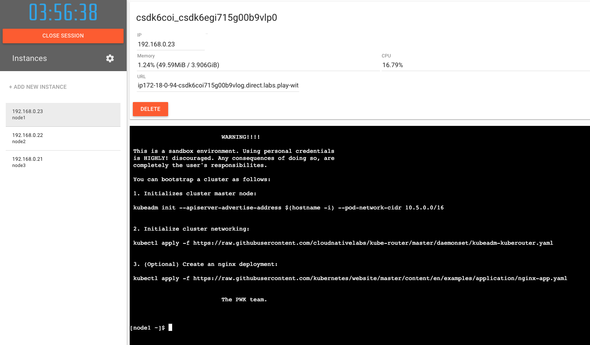

# Kubernetes Playground

Use `Play-with-kubernetes` to quickly setup a 3-nodes cluster and deploy a sample app

## Setup kubeadm-based cluster in Node1
### Access Play-with-Kubernetes at https://labs.play-with-k8s.com/

- Add 3 instances




### Initialize the cluster

```sh
[node1 ~]$  kubeadm init --apiserver-advertise-address $(hostname -i) --pod-network-cidr 10.5.0.0/16

Initializing machine ID from random generator.
...
You should now deploy a pod network to the cluster.
Run "kubectl apply -f [podnetwork].yaml" with one of the options listed at:
  https://kubernetes.io/docs/concepts/cluster-administration/addons/

Then you can join any number of worker nodes by running the following on each as root:

kubeadm join 192.168.0.13:6443 --token hfumzn.t10lxlfwh48qljp4 \
        --discovery-token-ca-cert-hash sha256:xxx
...
```

- Deploy a simple pod network using `kuberouter`

```sh
kubectl apply -f https://raw.githubusercontent.com/cloudnativelabs/kube-router/master/daemonset/kubeadm-kuberouter.yaml
```

- Check master node is up & running

```sh
[node1 ~]$ kubectl get no
NAME    STATUS   ROLES           AGE     VERSION
node1   Ready    control-plane   10m     v1.27.2
node2   Ready    <none>          2m46s   v1.27.2
node3   Ready    <none>          2m40s   v1.27.2
```

---

## Exploring Kubernetes Architecture and Components


Now that your Kubernetes cluster is set up, let’s explore the key components with a friendly analogy. Think of Kubernetes as a **port** where containers (your applications) are loaded onto ships (your nodes) and managed by various workers.

```sh
[node1 ~]$ kubectl get po -n kube-system
NAME                            READY   STATUS    RESTARTS   AGE
coredns-5d78c9869d-bvxng        1/1     Running   0          8m7s
coredns-5d78c9869d-qjc2p        1/1     Running   0          8m7s
etcd-node1                      1/1     Running   0          8m20s
kube-apiserver-node1            1/1     Running   0          8m18s
kube-controller-manager-node1   1/1     Running   0          8m17s
kube-proxy-99jc7                1/1     Running   0          21s
kube-proxy-k5h5t                1/1     Running   0          8m7s
kube-proxy-xkbnp                1/1     Running   0          15s
kube-router-cnx5m               1/1     Running   0          21s
kube-router-hqknl               1/1     Running   0          15s
kube-router-s5hdp               1/1     Running   0          113s
kube-scheduler-node1            1/1     Running   0          8m16s
```

### 1. **API Server**: The Gatekeeper
- The **API Server** is like the **port gatekeeper** and the **single contact point** for anyone who wants to manage or use the port. Whenever you ask Kubernetes to do something (like launching a new container), the request goes through the API server. It decides where and how things should happen in the cluster.
  
### 2. **Node**: The Ship
- A **node** is like a **ship** where the containers (your goods) are placed. Ships are responsible for running and transporting these containers. Each ship (node) in the port (cluster) can carry a certain number of containers based on its capacity.

### 3. **Scheduler**: The Crane Operator
- The **scheduler** is like the **crane** that picks up containers (workloads) and decides which ship (node) is the best place to put them. It makes decisions based on the type of goods (resource requirements), the available space on the ships, and the priority of the shipments.

### 4. **Controller Manager**: The Supervisor
- The **controller** acts like the **supervisor** in the port, keeping track of the number of containers of each type. If any container breaks (a pod fails), the controller replaces it to ensure the number of containers (replicas) is always correct. It also makes sure certain types of goods (applications) are always available.

### 5. **etcd**: The Notebook
- **etcd** is like the **notebook** or **database** where all information about the port is written down. It keeps track of every container, ship, and everything else happening in the port. This notebook ensures that everyone in the port knows the current status of all operations.

### 6. **Kubelet**: The Crew Member on the Ship
- **Kubelet** is like the **crew member** on each ship (node). It takes care of loading and unloading the containers on the ship and keeps the containers running as instructed by the API server. It regularly checks the containers to make sure they’re in good health.

### 7. **Kube-proxy**: The Traffic Controller
- **Kube-proxy** is like the **traffic controller** at the port. It ensures that the communication between different containers on different ships is smooth, allowing them to exchange messages without problems. It handles the network traffic in the cluster.

---

Now you have a Kubernetes cluster up and running, and you understand how its components work together to manage your applications! With this knowledge, you can start deploying and managing workloads in your new cluster.
