# Step-by-Step Guide: Setting Up a New GCP Account for the Free Trial

This guide will help you create a Gmail account (if you don’t have one) and use it to register for the Google Cloud Platform (GCP) Free Trial. GCP’s free trial offers one of the most generous plans among cloud providers, giving $300 in credits for 90 days. Additionally, GCP’s user-friendly interface and flexibility make it a great choice for labs and training.

---

## Why Choose GCP?

- **Generous Free Trial**: GCP offers one of the highest free credits, with $300 valid over 90 days, unlike other cloud providers with lower limits.
- **User-Friendly**: GCP is designed to be intuitive and easy to navigate, making it suitable for newcomers to cloud services.
- **Consistency Across Trainees**: By using GCP, all trainees have a consistent experience and process, especially in labs using Cloud Shell.
- **No Hidden Costs**: GCP ensures safety by suspending resources once the trial credits or 90-day limit is reached, preventing unexpected charges unless explicitly upgraded.
- **Flexible Registration**: Unlike other cloud providers with stricter policies, GCP allows multiple free trial accounts with different email addresses tied to the same credit card.

---

## Step 1: Create a New Gmail Account (If Not Available)

1. **Visit the Gmail Sign-Up Page**:
   - Open your browser and go to [https://accounts.google.com/signup](https://accounts.google.com/signup).
   - Choose **Create account** with `For my personal use`
     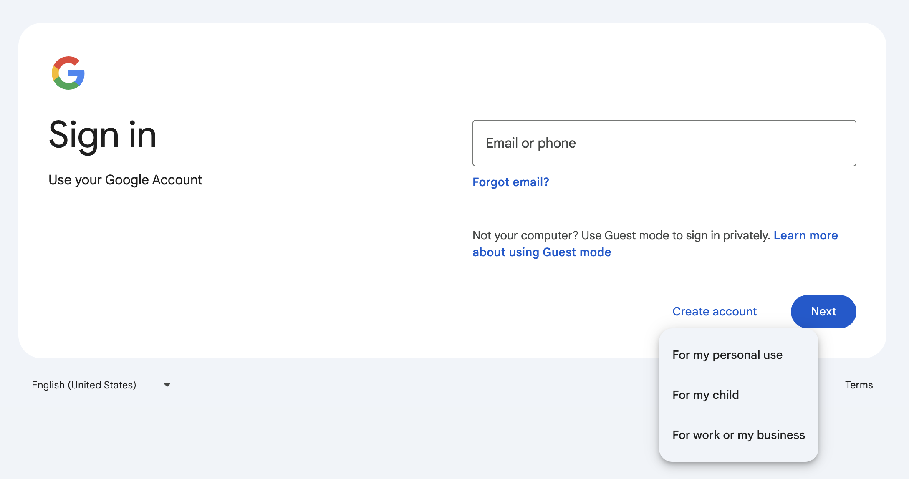

2. **Complete the Registration Form**:
   - Enter your **first name** and **last name**.
   - Choose a **username** (this becomes your Gmail address, e.g., `yourusername@gmail.com`).
   - Create and confirm your **password**.
   - Click **Next**.

3. **Verify with Your Phone Number**:
   - Optionally, provide a **phone number** for account verification. Google will send a verification code to this number.
   - Enter the **verification code** and click **Verify**.

4. **Add Recovery and Account Details**:
   - Optionally, add a **recovery email address**.
   - Provide your **date of birth** and **gender**.
   - Click **Next**.

5. **Review and Accept Terms**:
   - Read Google’s **Privacy and Terms**, then scroll down and click **I agree**.

6. **Confirm Your Gmail Account**:
   - Visit [https://mail.google.com/](https://mail.google.com/) to verify your account is active and accessible.

---

## Step 2: Register for GCP’s Free Trial

1. **Go to the GCP Free Trial Page**:
   - Visit [https://cloud.google.com/free](https://cloud.google.com/free) and click **Get Started for Free**.

2. **Sign In with Your Gmail Account**:
   - Use the Gmail account you just created to sign in.
   - Hit **Start free** to continue
     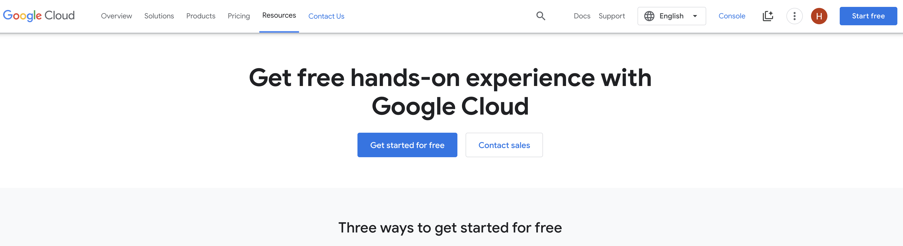

3. **Start the registration process**:
   - Hit **Agree & continue**.
     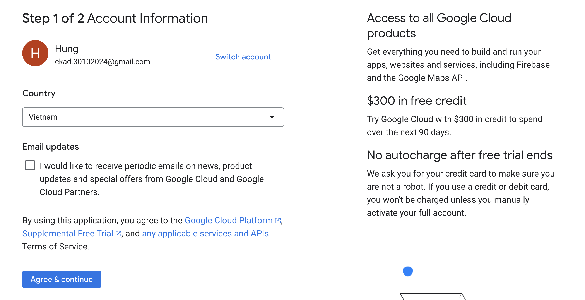
   - Create new payments profile
     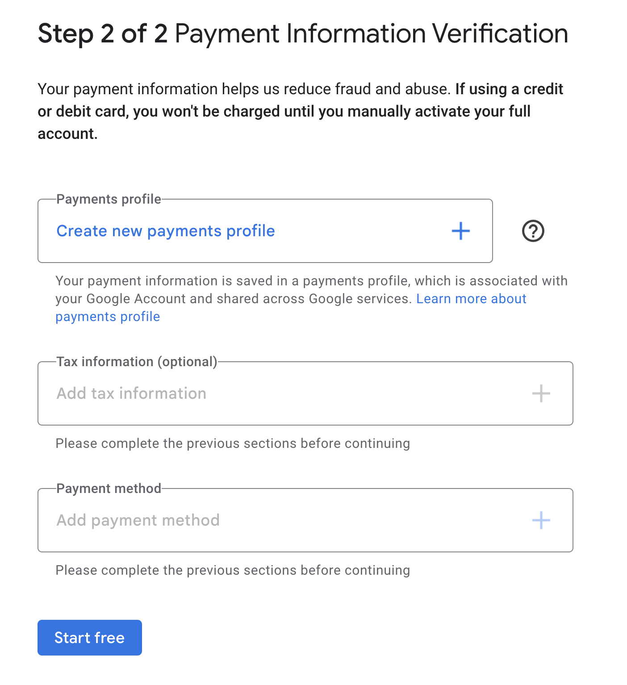

     
   
   - Add payment method (skip `Add tax information`)
     

     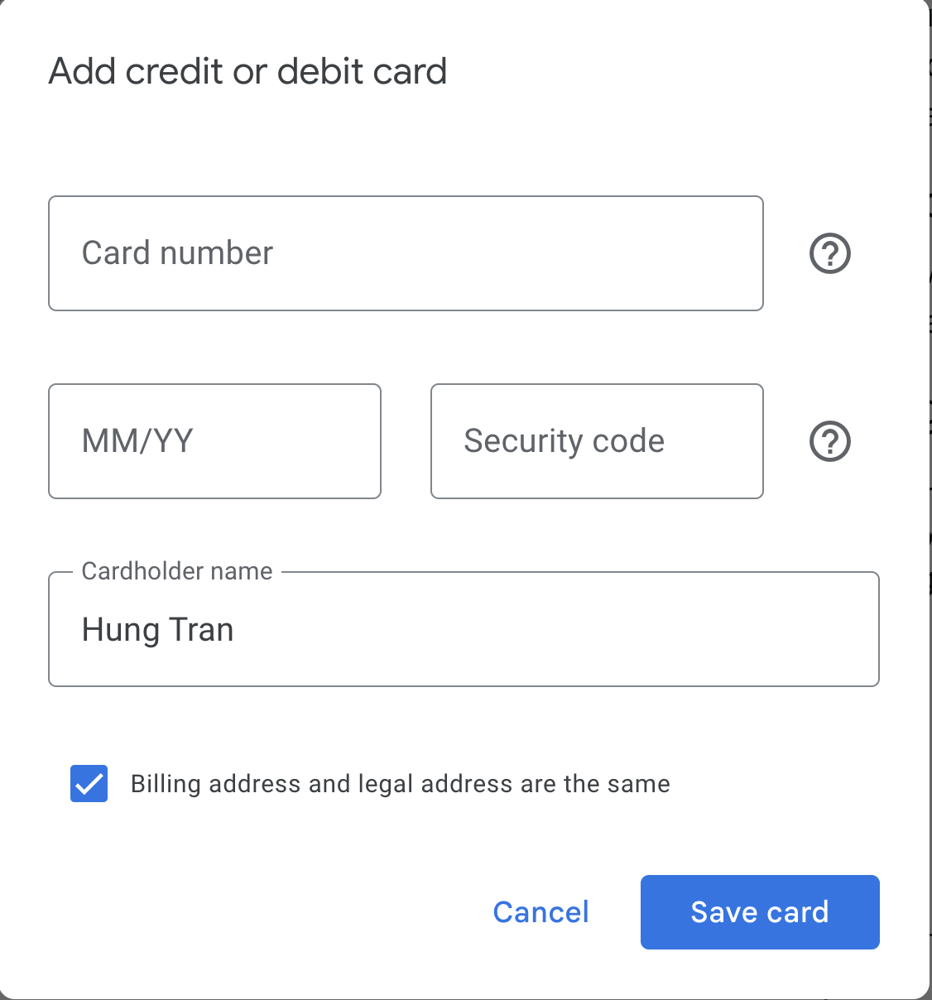

   - Hit **Start free** to continue
     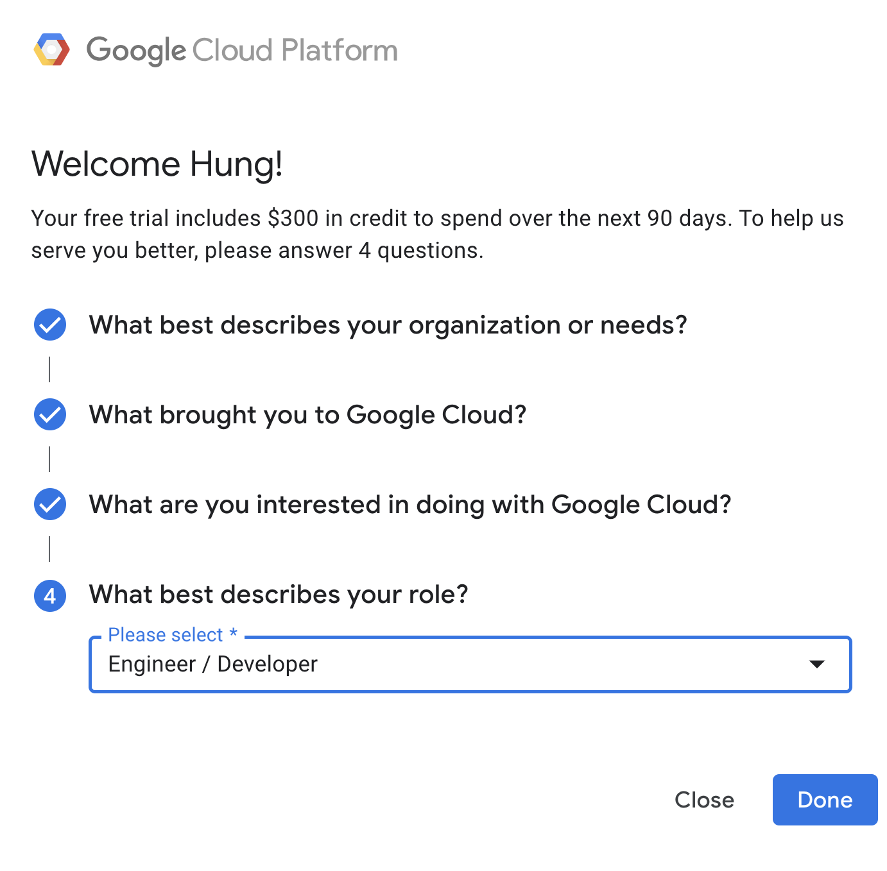

   - Now you have a **Free Trial** GCP account.
     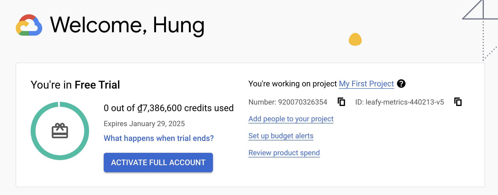

> **⚠️ CRITICAL ALERT: YOU SHOULD NEVER EVER UPGRADE THIS ACCOUNT TO A FULL ACCOUNT!**
>
> Upgrading this account will end the free trial, making all resources billable. Stick to the free trial limitations to avoid unexpected charges. Once the trial expires, Google Cloud will automatically suspend the resources to prevent additional costs. Only use free-tier resources and avoid any upgrades.

4. **Start the Free Trial**:
   - Click **Start My Free Trial**. Your account will now have $300 in free credits for 90 days.

5. **Access the Google Cloud Console**:
   - You will be directed to the **Google Cloud Console**. Explore GCP services with the free trial credit.

> **Tip**: To keep using GCP for labs or training beyond the trial period, you can create multiple free trial accounts with different emails using the same credit card. This is unique to GCP and can help avoid costs while gaining cloud experience.

---

## Step 3: Begin Exploring GCP

1. **Create a New Project**:
   - In the GCP Console, click on the **Project** drop-down at the top of the page and select **New Project**.
   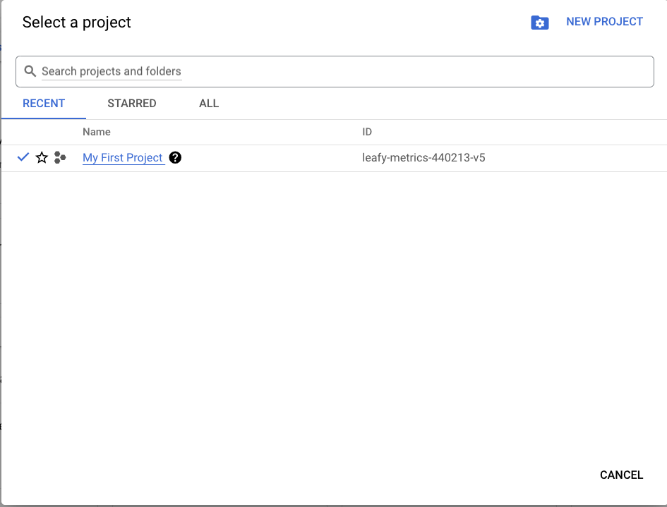
     
   - Name your project (e.g., "GCP-Lab-Project") and ensure the **Organization** is set to "No Organization" if this is your personal account.
   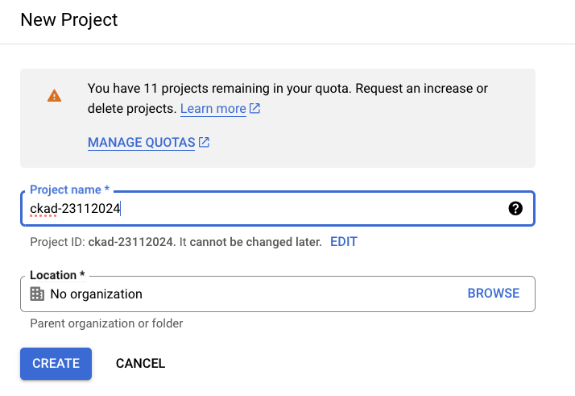
   - Click **Create** to generate a new project.

2. **Add Users and Share Project Access** (optional):
   - Navigate to **IAM & Admin** > **IAM** in the GCP Console for your newly created project.
   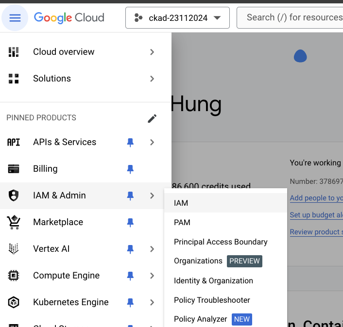
   - Click **GRANT ACCESS** to invite another user (using their email address). In the **New Principals** field, enter their email.
   - Assign the role **Owner** to give them full permissions on the project, including the ability to manage billing as **Billing Administrator**.
   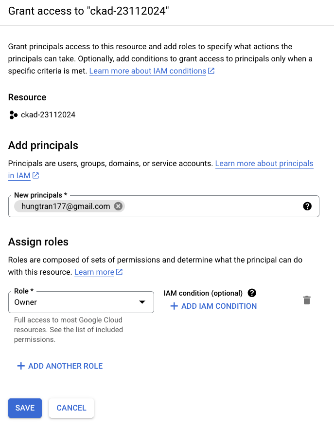
   - Click **Save** to grant access, enabling the added user to share in managing this project without having to create a separate GCP Free Trial account.
   - The invited account must check their email to accept the invitation to join the project.
   
   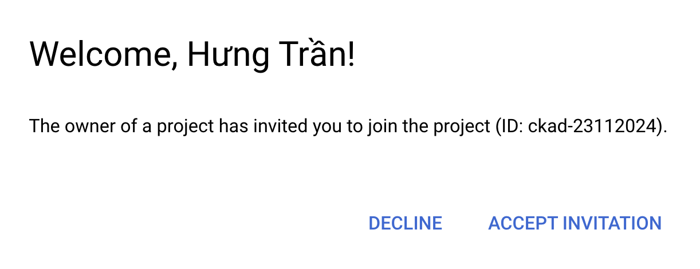

3. **Use Cloud Shell**: 
   - Click on the **Cloud Shell** icon in the GCP Console to open an interactive terminal environment within your browser.
   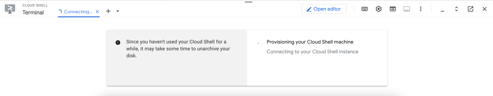

   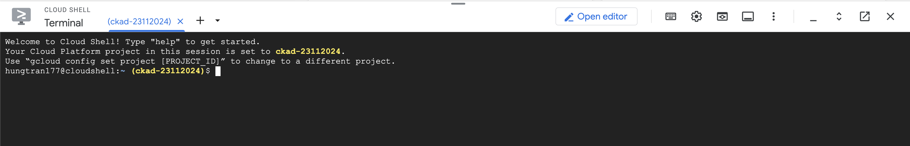
   
   ### What is Cloud Shell?
   Cloud Shell is an online terminal directly integrated into the GCP Console, providing a pre-configured environment with tools, permissions, and storage needed to work on your projects. It also offers a persistent home directory (5GB), which retains files between sessions.

   ### Benefits of Using Cloud Shell:
   - **Consistent Environment**: Ensures all users have the same setup, making it easy for teams or students to follow the same instructions without environment issues.
   - **Free to Use**: Cloud Shell doesn’t consume your trial credits, allowing you to explore and experiment freely.
   - **Pre-installed Tools**: Essential GCP tools, such as `gcloud`, `kubectl`, `helm`, `kustomize` and other development tools, are already installed and configured, reducing setup time.
   - **Security**: Avoids local setup issues and securely accesses your GCP resources without additional configuration.

4. **Explore Core Services**:
   - With the free trial, you can experiment with core GCP services such as **Compute Engine** for virtual machines, **Cloud Storage** for object storage, and **BigQuery** for data analysis.
   - For the upcoming lab, we will use this GCP account to create Kubernetes clusters using both **kubeadm-based clusters** on Compute Engine and managed **GKE clusters**. This will enable you to understand the fundamentals of Kubernetes setup and explore GCP’s managed Kubernetes service for ease and efficiency.

---

### Summary

By following these steps, you’ll have a new Gmail and GCP account with $300 in free credits, accessible for 90 days. GCP’s flexible trial policies and intuitive platform provide a safe, consistent, and effective environment for learning cloud services without incurring costs. Enjoy exploring GCP’s powerful suite of tools!
